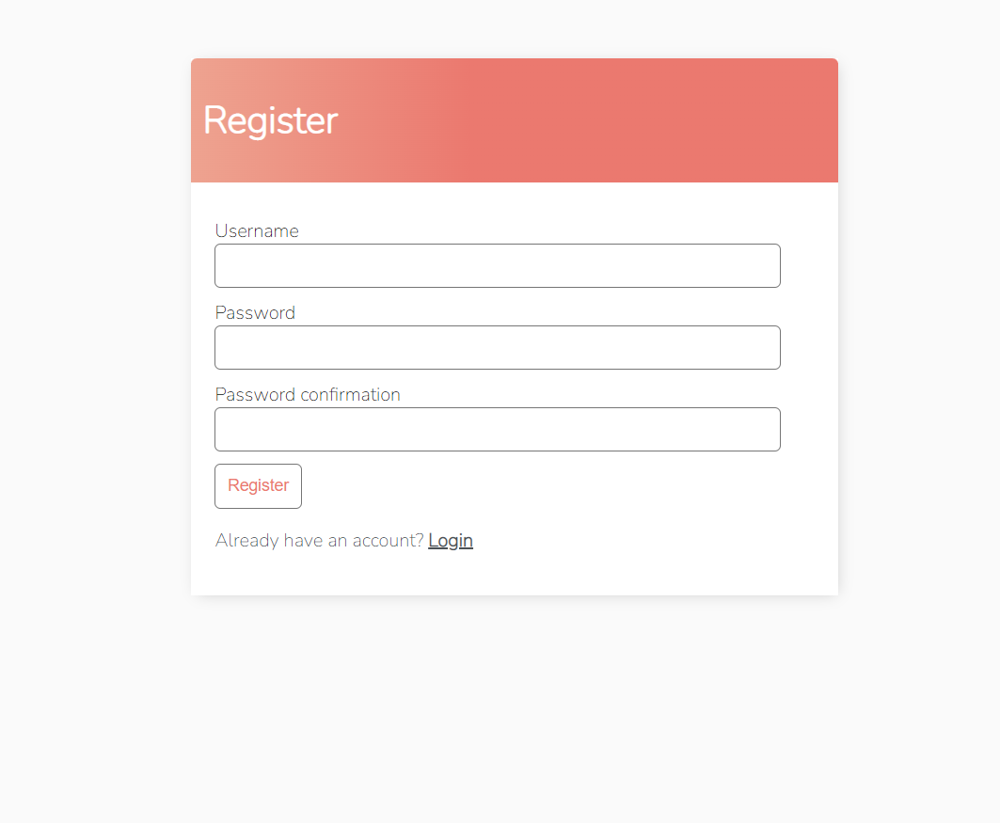
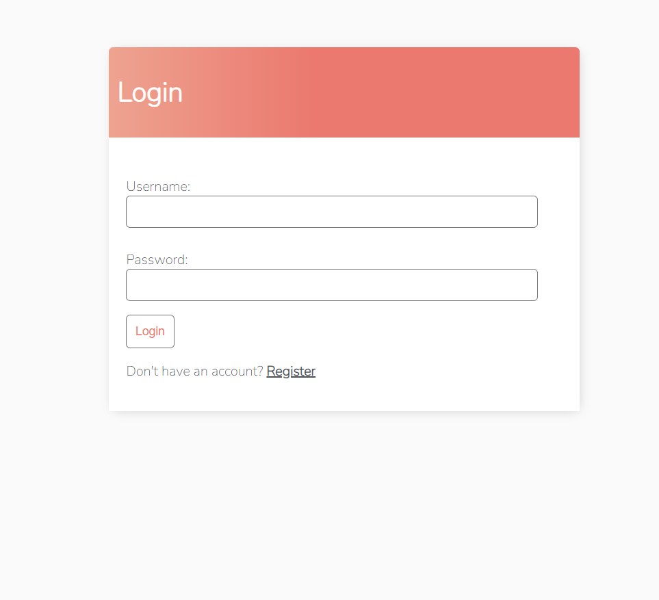
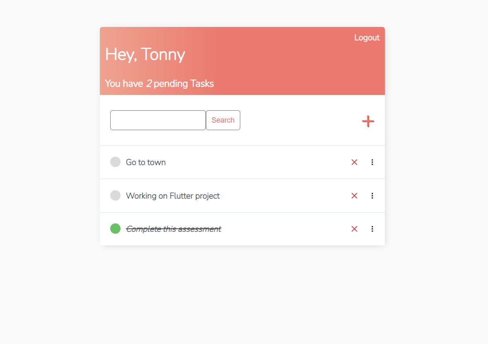
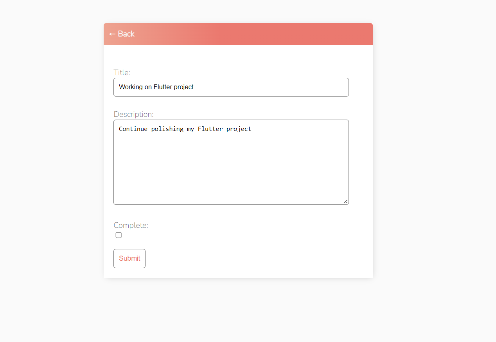

# Task Manager App
This is a basic Task Manager App. It lets users monitor their pending tasks, add more or remove those completed. These are the CRUD operations we aim to accomplish

## User registration

## User Login

## A display of the user account

## App Functionality

# Replicating the project
### 1. Clone the repository: git clone https://github.com/Tonny-Kioko/Task-Manager.git

### 2. Navigate to the project directory: "cd Task_Manager"

### 3. Create a virtual environment: "python -m venv venv"

### 4. Activate the virtual environment: Windows - "venv\Scripts\activate"  MacOS and Linux - "source venv/bin/activate"

### 5. Install the dependencies: "pip install -r requirements.txt"

### 6. Run database migrations "python manage.py migrate"

### 7. Start the development server: "python manage.py runserver"

### 8. Access the application in your web browser at 'http://localhost:8000'
